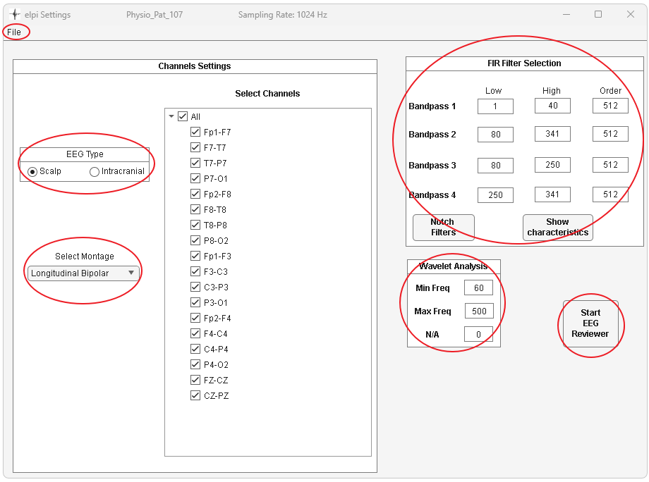
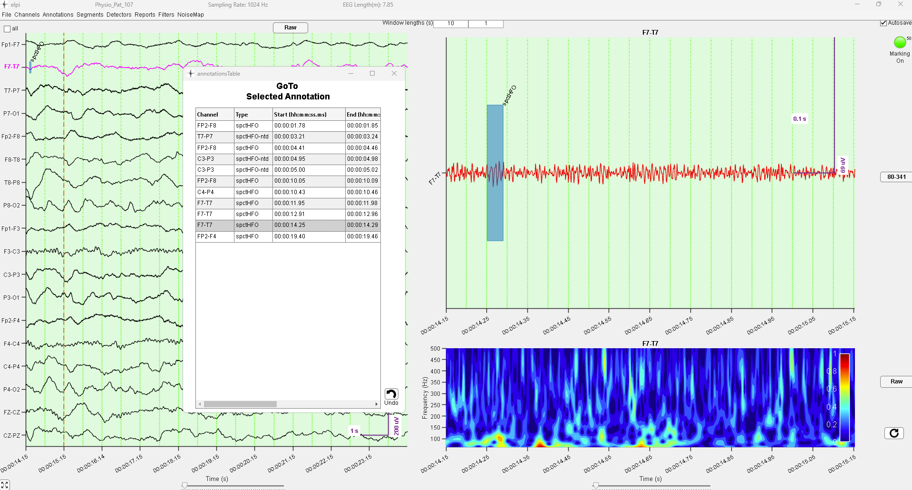

# ELPI User's Guide

## Table of Contents

1. [Overview](#overview)
2. [System Requirements](#system-requirements)
3. [Getting Started](#getting-started)
4. [Initial Setup](#initial-setup)
5. [Core Features](#core-features)
6. [Typical Workflow](#typical-workflow)
7. [Visual Interface Components](#visual-interface-components)
8. [Annotation System](#annotation-system)
9. [Signal Processing and Filtering](#signal-processing-and-filtering)
10. [Detection and Analysis Tools](#detection-and-analysis-tools)
11. [Data Export and Import](#data-export-and-import)
12. [Quality Assessment](#quality-assessment)
13. [Advanced Features](#advanced-features)
14. [Troubleshooting](#troubleshooting)
15. [Keyboard Shortcuts](#keyboard-shortcuts)

## Overview

ELPI is a MATLAB-based application designed for informed EEG signal analysis and annotation of events. The system supports both scalp and intracranial EEG recordings and provides tools for signal visualization, filtering and event annotation.

### Key Capabilities:
- Multi-format EEG file support (EDF, LAY, BrainVision, Micromed files) (Enabled by Fieldtrip)
- Simultaneous visualization of Raw, Filtered and Time-Frequency transformed EEG with multiple time scales
- Customizable FIR filters
- Interactive event annotation and editing
- Noise analysis
- Occurrence rate reporting
- Data export capabilities

## System Requirements

- MATLAB R2023b:
    - Computer Vision Toolbox
    - Image Processing Toolbox
    - Signal Processing Toolbox
    - Statistics and Machine Learning Toolbox
    - Wavelet Toolbox
- FieldTrip toolbox (automatically initialized)
- Sufficient RAM for EEG file processing (recommended: 16GB+)
- Compatible EEG file formats: EDF, EDF+, LAYDAT, VHDR, TRC

## Getting Started

### 1. Launch ELPI

1. Download elpi_public folder
2. Run the elpi.exe
3. Check Display settings, Zoom should be set to 100%, (not more!), otherwise the windows will not scale correctly

### 2. Load EEG Data
1. Click **"Open EEG File"** in the main settings window
2. Select your EEG file (e.g.: .edf, .lay, .vhdr)
3. The system will automatically detect sampling rate and channel configuration

## Initial Setup

### EEG Type Selection

Choose the appropriate EEG type:
- **Scalp EEG**: For surface electrodes
- **Intracranial**: For depth electrodes, grids, and strips

### Channel Configuration

1. **Scalp EEG Options**:
   - Physical Reference
   - Bipolar Montages (Longitudinal Bipolar)

2. **Intracranial Options**:
   - Bipolar montages automatically generated from electrode pairs

### Filter Setup

Configure up to 4 bandpass filters:
- **Filter 1**: Broad band (default: 1-40 Hz) - for general EEG viewing
- **Filter 2**: HFO band (default: 80-500 Hz) - for high-frequency oscillations
- **Filter 3**: Ripple band (default: 80-250 Hz) - for ripple detection
- **Filter 4**: Fast Ripple band (default: 250-500 Hz) - for fast ripple detection

These filters have default values for HFO annotation. The filters can be adjusted to annotate other events like sleep-spindles.

### Wavelet Analysis

Set parameters for time-frequency analysis:
- **Min Frequency**: Lower bound for spectrogram (default: 60 Hz)
- **Max Frequency**: Upper bound for spectrogram (default: 500 Hz)
- **Steps**: Frequency resolution

---
## Core Features

### 1. Multi-Panel Display System

**Three Main Visualization Panels:**

#### Big Window (Top Panel)
- Overview display showing multiple channels
- Configurable time window (default: 10 seconds)
- Navigation and channel selection
- Annotation overlay display
- Select signals to display in Small Window
- Rotate through filters independently from other windows

#### Small Window (Middle Panel)
- Zoomed view of selected channel
- Higher temporal resolution (default: 1 second)
- Detailed signal examination
- Precise annotation placement
- Select signals to display in Spectrogram window
- Rotate through filters independently from other windows

#### Heatmap/Spectrogram (Bottom Panel)
- Time-frequency representation
- Wavelet-based analysis
- Frequency range: configurable (60-500 Hz default)
- Color-coded power representation
- Rotate through filters independently from other windows

### 2. Navigation System

**Horizontal Navigation:**
- Left/Right arrow keys: Navigate through time at a speed of the window length
- Shift + Left/Right arrow keys: Navigate through time at a speed of 1/10 the window length
- Mouse Scroll wheel: Navigate through time at a speed of 1/10 the window length

**Vertical Navigation:**
- Up/Down arrow keys: adjust sensitivity

**Window Controls:**
- Button at lower left corner rotates through window selection

### 3. Annotation of Events
#### 3.1 New annotations
- Enable/Disable annotation mode using Marking On/Off button at top right corner
- Draw annotation on EEG:
   - Press "s" key and draw mark: introduced mark is channel specific
   - Press "a" key and draw mark: introduced mark is channel agnostic

#### 3.2 Saving annotations   
- Autosave annotations can be turned on/off. After 50 annotations, the user is asked to save the events to a file.
- To manually save annotations, go to: 
   → Annotations Menu → Save to file

#### 3.3 Editing annotations
- Annotations can be clicked, a window will pop up with editable information
- To remove all annotations in current Big Window:
   - Press "r" key and follow instructions

#### 3.4 Customizing annotation types and colors
- In the Annotations Menu:
   → Settings → Select Type to Mark

#### 3.4 Traversing annotations

- In the Annotations Menu:
   → Show list
- A window will pop-up with all annotations. Select an annotatio either with the keyboard or mouse 
- The selected annotation will be highlighted on the EEG windows
   - To change the highlight mode to show all signals on the small window:
      → Settings → Traverse Style
- Annotations can be selected using list. Select a row and press the "Del" key on the keyboard
- The last deletion can be undone by clicking on the "Undo" button at the bottom right of the list 

### 4 Analysis and Export

4.1. **Generate Reports**
   - Go to Reports → Occurrence Rate
   - Export results to files

4.2. **Export Data**
   - Save annotations to file formats
   - Export EDF clips of interesting segments
   - Save processed signals

### 5 Noise Analysis

5.1 **Real-Time Quality Assessment:**
- Continuous noise index calculation
- Channel-specific quality metrics
- Overall recording quality assessment
- Visual quality mapping

5.2 **Quality Indicators:**
- Green: Good signal quality (NI < 0.1)
- Red: Poor signal quality (NI > 0.1)
- Real-time updating during review

---

### Control Elements

**Filter Buttons:**
- Cycle through configured bandpass filters
- Real-time filter switching
- Visual indication of active filter

**Sliders and Input Fields:**
- Big Window: Position and length controls
- Small Window: Position and length controls
- Numeric input for precise values

## Annotation System

### Annotation Types

**Default Event Types:**
- **IED**: Interictal Epileptiform Discharges
- **HFO**: High-Frequency Oscillations (general)
- **Ripple**: Ripples (80-250 Hz)
- **FR**: Fast Ripples (250-500 Hz)
- **Spindle**: Sleep Spindles
- **Noise**: Noise artifacts
- **Bad**: Bad signal segments

### Annotation Properties

Each annotation contains:
- **Channel**: Source channel or multi-channel flag
- **Type**: Event classification
- **Start Time**: Event onset (seconds)
- **End Time**: Event offset (seconds)
- **Start Sample**: Sample number of onset
- **End Sample**: Sample number of offset
- **Comments**: User-defined notes
- **Channel Specific**: Single vs. multi-channel flag
- **Creation Time**: Timestamp of annotation
- **Username**: Annotator identification

### Annotation File Formats

**Supported Import:**
- MATLAB .mat files
- ELPI native format with full metadata
- LAY file integration for Persyst compatibility

## Signal Processing and Filtering

### Bandpass Filtering

**Four Configurable Filters:**
- Independent low and high cutoff frequencies
- Real-time filter switching during review

**Filter Applications:**
- Filter 1: General EEG (1-40 Hz)
- Filter 2: HFO detection (80-500 Hz)
- Filter 3: Ripple analysis (80-250 Hz)
- Filter 4: Fast Ripple analysis (250-500 Hz)

### Notch Filtering

**Line Noise Removal:**
- Configurable for 50 Hz or 60 Hz systems
- Multiple harmonic removal (up to 20 harmonics)
- Channel-specific application
- Adjustable filter order

**Features:**
- European/American power system presets
- Real-time application
- Minimal signal distortion

### Wavelet Analysis

**Time-Frequency Decomposition:**
- Continuous Wavelet Transform (CWT)
- Morlet wavelet basis
- Configurable frequency range
- Real-time spectrogram display

**Applications:**
- HFO visualization
- Frequency content analysis
- Time-frequency event characterization

## Troubleshooting

### Common Issues

**Pop-up windows dissapearing:**
- Pop-up Windows will be sent to the background when interacting with the main window. To 
bring the pop-up windows to the foreground again use the Ctrl+Tab shortcut

**Buttons not visible, Window not scaling correctly:**
- Set display zoom level to 100%

**Performance Issues:**
- Plug in computer to power supply!
- Close unnecessary applications
- Reduce number of displayed channels
- Lower filter orders if needed
- Elpi runs extremely slow on Matlab 2025, stick to Matlab2023a or Matlab2023b and performance should be fine

### Error Messages

**"Sampling Rate too low":**
- Ensure sampling rate > 1000 Hz for HFO analysis
- Check file header information
- Consider resampling if necessary

**"No EEG channels found":**
- Verify channel labels in file
- Check montage configuration
- Ensure proper file format

---

*Version: 2025.2*
*Last Updated: September 2025*
